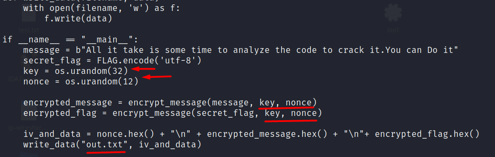
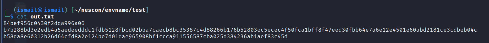
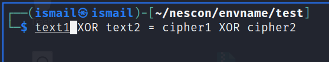
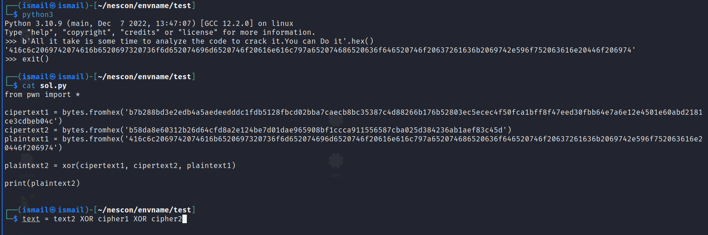
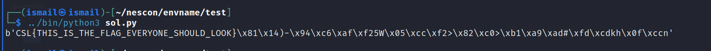

## Chachu has lost his message

This was a crpyo challenge with source code and the file given.

At the code we can see that the flag and the message is being encrypted from the same key and the nonce. This causes the issue in the cipher being used.
.

## Looking at out.txt
Below is the out.txt file containing the nonce , message and the flag encrypted.
.

## Issue
As told above, using same nonce and key could lead to such relationship as shown below.
.

## Solving
Using the above relationship we can take the hex of the plaintext and do the XOR to get the flag.
.

## Flag
Running the sol.py gives the flag
.