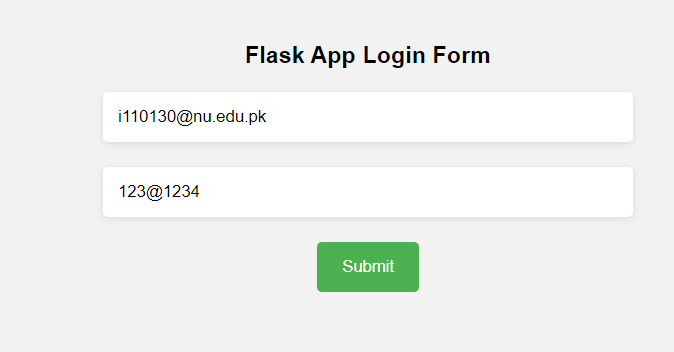
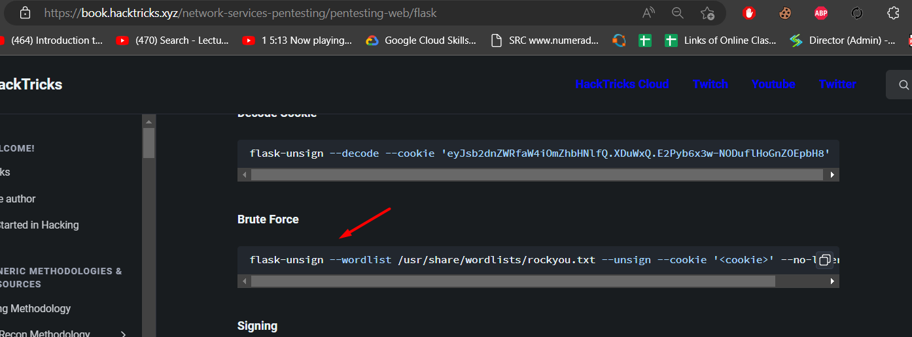

# Flask App

This is a simple web application that asks for login credientials. 

.

In the web app following are common places to look.

/robots.txt  
/sitemap.xml 
/crossdomain.xml 
/clientaccesspolicy.xml 
/.well-known/ 
/.github/ 

## Looking at Robots.txt
Looking at robots.txt we see the message directory.

.

## Looking at /message
At message we see it says we need to put a messageid parameter.
.

## Putting the parameter
After putting the parameter we get a link to a github repo where we know that the mail credientials are used for login from the message.
.

## Finding creds
I have used simple search query to find the creds.
.

Scrolling down a bit we can found the creds.
.

## Logging in
Now by using these creds we can login into the app
.

## After logging in
After loggin in we can see the following screen.
.

## Looking at the cookies
We know that it is a flask app. if you google a bit you would come to know that the first part is base64 and contains the payload while the other part is of secret that is used to sign this cookie.

.

## Looking at payload of cookie
At cyber chef if we do base64 decode we can see the user as john.

.

## How to get secret
If you google about the hacking of flask cookie there are many tools & tricks. However, am gonna openup first link in my results.

.

## Selecting tool
At that link i found a flask-unsign tool that could be used to find the secret from the given cookie. 
.

## Found the Secret
Now using that tool I have found the secret.
.

## Getting flag
Now after inputting that secret we can get the flag.
.