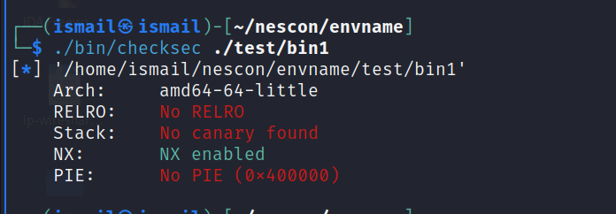

# Binary 1

This challenge was a very basic 64 bit Stack Overflow in which user needs to find the right offset and execute the flag function. 

## About Binary
Executing a binary asks user to enter a string. If we try different input we observe that if we put a larger input then it overflows and gives the segmentation fault. Using ``` file <ELF> ``` command we observe it is x86-64 binary.

.

## Looking at Functions
we can use  ``` objdump -d <ELF> ``` to get the list of all the functions inside the elf binary. Looking at the functions we see a flag function with it's address.

Alternatively, you can use ``` readelf -s <ELF> ``` to get the address of flag function.

.

## Checking the security
Checking the security of the binary we see There is absolutely NO security enable except NX.

.

## Finding the Offset
Firtly, Creating a random pattern of 100 and then we can input that into the binary. Now looking at the RIP register we see that it is calling the rdx register. And the value in the rdx register is 1AAe.

.

Finding the offset of the value into rdx gives 72. It means that we can put random address after 72 bytes of input and RIP register will point to our address.

.

Alternatively, we could also find the offset of value into the rbp register and subtract 8 from it to reach the return address.

# Getting the Flag

Now we have the right offset and the address of the flag function. So, let's get the flag!

.

<Q is used for 64 bit address in Little Endian. Alternative to p64 function in pwntools.