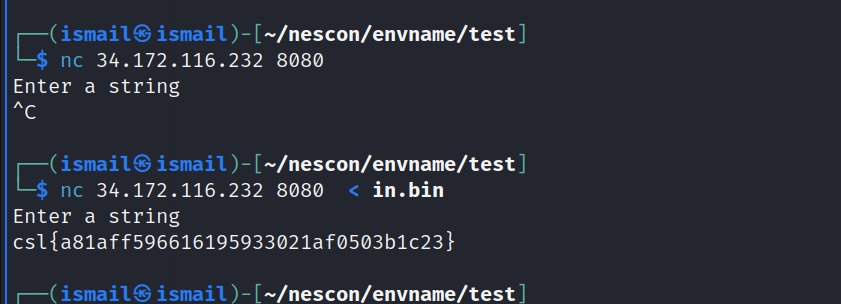

# Binary 2

This is the most easiest challenge someone could except in a pwn. This challenge was a very basic 32 bit Stack Overflow in which user needs to find the right offset and execute the flag function. 

## About Binary
Executing a binary asks user to enter a string. If we try different input we observe that if we put a larger input then it overflows and gives the segmentation fault. Using ``` file <ELF> ``` command we observe it is x86 binary.

.

## Looking at Functions
we can use  ``` objdump -d <ELF> ``` to get the list of all the functions inside the elf binary. Looking at the functions we see a flag function with it's address.

Alternatively, you can use ``` readelf -s <ELF> ``` to get the address of flag function.

.

## Checking the security
Checking the security of the binary we see There is absolutely NO security enable except NX.

.

## Finding the Offset
Firtly, Creating a random pattern of 100 and then we can input that into the binary. Now looking at the RIP register we see that it has 'AAIA'.

.

Now, By finding the offset of it we can see it's 70.
.


# Getting the Flag
Creating the payload. <L is used for 32 bit address in Little Endian. Alternative to p32 function in pwntools.

.

Now we have the right offset and the address of the flag function. So, let's get the flag!

.