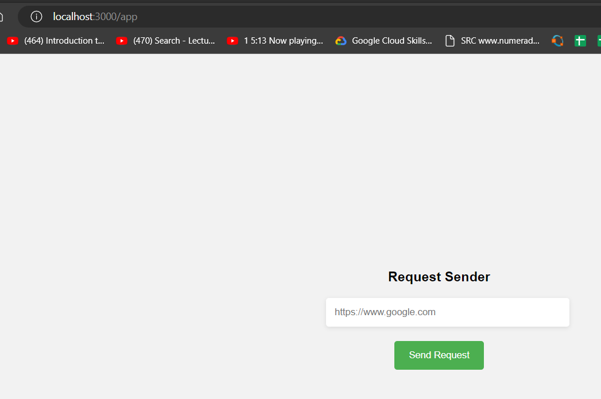
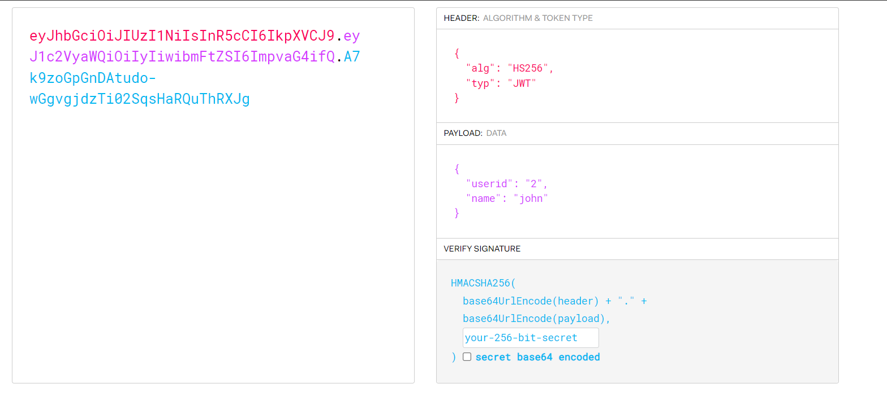
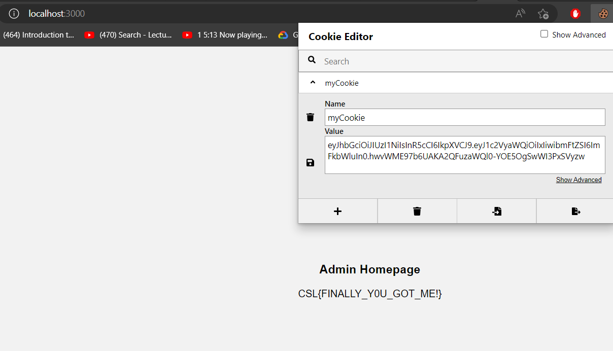

# Cook the token

This is a simple web application that says the website is under development.

.

In the web app following are common places to look.

/robots.txt  
/sitemap.xml 
/crossdomain.xml 
/clientaccesspolicy.xml 
/.well-known/ 
/.github/ 

## Looking at robots.txt

we can see 2 directoires login and the api.
.
## Looking at login

At the login form we need to give some creds.
.

## Looking at api
At api we need to give userid parameter 
.
 After giving at userid to 1 we know that it is of admin 
.
By putting the userid as 2 we see a message saying that only localhost is allowed to access this resource. 
.
 It means we need to figure out some way to send the request from the sever to this address. 

 ## Looking at sitemap.xml

At sitemap.xml we see 2 more directoires. Let's see them one by one.  
.

At message we see that we are being given a hint that we must be using secure keys for signing something. 
.

Looking at the app we see a request sender app. Now, from the above we had a resource where only localhost could send the request to. So, maybe we can use this app to access that resource ? 
.

## Getting userid=2 localhost message

Now putting in the url we get some string in return which is base64 as mentioned at the start of the string. 

.

## Decoding the message
From here, we got the creds of the john with the password. 
.

## Logging in

We can use these creds to login at /login.
.

## After logging in
After logging in we see a simple page.
.

## Looking at cookies
Looking at the cookies we see that it is Jwt Token. 
.

## Chatgpt for cookies
If someone don't know about jwt. we could have put that string on chatgpt to show many things.

.

## Looking at jwt

There is a famous website named jwt.io which can be used to see the jwt tokens.
.

Here, we can see that the userid = 2 and the user is john. From the enumeration above /api?userid=1 we know that the admin has userid of 1 and name as admin. 

## Building attack
Now, If we replace userid=1 and user=admin and sign the cookie and replace it with already present jwt token. we could login as admin. As /message above already gives us the hint that the key is not secure which is used for signing.

So, After little google You could come across different tools. One famous one is jwt-cracker.

I passed this tool the john cookie and i was able to get the key within a minute.
.

## Final payload

Here I have changed the secret to "hahe" found from above and userid=1 and name=admin.

.

## Getting the flag

I replaced the cookie with the new token using cookie editor extention and saved it.
.

After reloading the page and going back to /. I got the flag.
.
